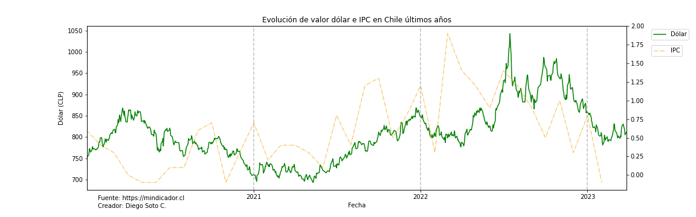
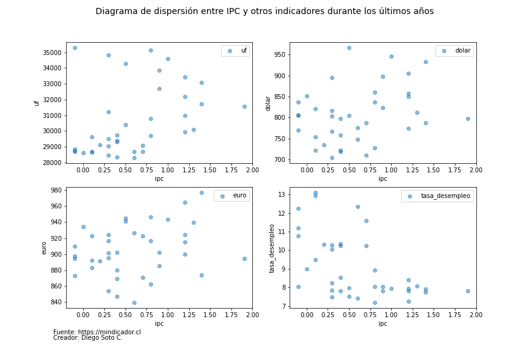

# Análisis financiero CL
En este análisis se verificará el avance de la economía en Chile en los últimos 3 años, para esto, en el módulo `ExtractData` se generó una función que extrae los registros de los últimos años apoyado por la API de https://mindicador.cl. la función en específico es:

```python
def ExtractData(indicator, InitialYear, EndYear = None):
    """
    Con esta función se extraen los datos de los indicadores de Chile según API de https://mindicador.cl

    Args:
        indicator: str que debe indicar el indicador que se extraerá. Los posibles datos son [uf, ivp, dolar, dolar_intercambio, euro, ipc, utm, imacec, tpm, libra_cobre, tasa_desempleo, bitcoin]

        InitialYear: int con año que se desea extraer.

        EndYear: Argumento opcional en caso de requerir el análisis por más años.

    Returns:
        Dataframe: El retorno es un df con los datos del año o años seleccionados junto con el valor en CLP.
    """
    if EndYear is None:
        EndYear = InitialYear
    else:
        # Lo siguiente se realiza para no tener inconvenientes en el for por el índice de python
        EndYear = EndYear + 1
    if InitialYear > int(datetime.now().strftime("%Y")):
        return print('El año no puede sobrepasar al actual')

    indicadores_df = pd.DataFrame()
    if InitialYear == EndYear:
        url = f'https://mindicador.cl/api/{indicator}/{InitialYear}'
        response = requests.get(url)
        df = pd.DataFrame.from_dict(response.json())
        df = pd.DataFrame(df['serie'].values.tolist())
        indicadores_df = pd.concat([indicadores_df, df], ignore_index=True)
    elif InitialYear < EndYear:
        for year in range(InitialYear, EndYear):
            url = f'https://mindicador.cl/api/{indicator}/{year}'
            response = requests.get(url)
            df = pd.DataFrame.from_dict(response.json())
            df = pd.DataFrame(df['serie'].values.tolist())
            indicadores_df = pd.concat([indicadores_df, df], ignore_index=True)
    else:
        return print('El año final debe ser mayor al inicial')
    return indicadores_df
```
## Primera extracción
Utilizando la función anterior, en un comienzo se extraen los datos de los siguientes indicadores:
```python
indicadores = ['uf', 'dolar', 'euro', 'ipc', 'tasa_desempleo']
```
Se optó por extraer todos los datos en un solo df para verificar datos tanto por separado, como juntos

## Análisis preliminar
### Dólar - IPC
Lo primero a analizar fue la evolución del dólar durante los últimos años, sin embargo se agregó un eje de IPC para confirmar si hay algún tipo de relación, para esto se creo el siguiente gráfico:


Como se puede apreciar el dólar tuvo un alza por sobre los 1.000 CLP a mediados del 2022, esto poco a poco se ha ido estabilizando y ahora la tendencia es principalmente a la baja. Con respecto al IPC realmente no debería influir ya que el gráfico no muestra alguna relación en las subidas y bajadas. Por esta razón se buscará alguna otra relación entre indicadores.

### IPC con otros indicadores
Al ser el IPC un indicador mensual y como algunos otros indicadores los fines de semana no se mueven, para compararlos se tendrá que crear un nuevo df con los datos del IPC y los datos de los otros indicadores para esa fecha en concreto, para suplir esto, se creó un nuevo df con las fechas del primer y último indicador de IPC, luego ese df se juntará con otro, para rellenar los espacios en blanco por medio de los métodos ``ffill()`` y ``bfill()``. El resultado de esto se junta con el data frame original de IPC.
El código utilizado es:
```python
# Creación de df fechas con el máximo y mínimo de ipc, esto con el fin que en el siguiente for, pueda completar los registros faltantes en algunas fechas
fechas = pd.date_range(start=df_ipc['fecha'].min(), end=df_ipc['fecha'].max())
df_fechas = pd.DataFrame({'fecha': fechas})

# Lo siguiente se recorre con un for por indicador
df_i = df_indicadores_original[df_indicadores_original['indicador'] == i].copy().reset_index()
df_i = df_i.drop(['indicador', 'index'], axis=1)
df_i = df_i.rename(columns={'valor': i})
df_i['fecha'] = pd.to_datetime(df_i['fecha'].dt.date)

# Se crea un join con el df fechas creado anteriormente para obtener los datos más aproximados de las fechas
df_aux = pd.merge(df_fechas, df_i, on='fecha', how='left')
# Lo siguiente es para rellenar los campos vacíos con el valor más cercano antes de hacer el join con la tabla de ipc
df_aux = df_aux.ffill() # Primero rellena todo hacia abajo
df_aux = df_aux.bfill() # Para los casos en que la primera fila quede con NaN, se rellena hacia arriba
df_final = pd.merge(df_ipc, df_aux, on='fecha', how='left')
```

Luego del recorrido anterior, se crea un gráfico de dispersión por cada indicador vs IPC, el resultado es el siguiente:


Gracias a este gráfico podemos comprobar que el valor del IPC no tiene relación con ninguno de los otros indicadores.
