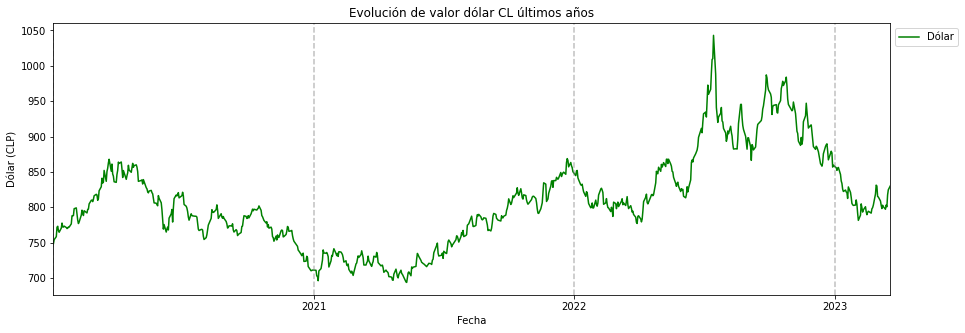

# Análisis financiero CL
En este análisis se verificará el avance de la economía en Chile en los últimos 3 años, para esto, en el módulo `ExtractData` se generó una función que extrae los registros de los últimos años apoyado por la API de https://mindicador.cl

En un comienzo se extraen los datos de los siguientes indicadores:
```python
indicadores = ['uf', 'dolar', 'euro', 'ipc', 'tasa_desempleo']
```
Se optó por extraer todos los datos en un solo df para verificar datos tanto por separado, como juntos

## Análisis dólar
Lo primero a analizar fue la evolución del dólar durante los últimos años, para esto se creo el siguiente gráfico:


Como se puede apreciar el dólar tuvo un alza por sobre los 1.000 CLP a mediados del 2022, esto poco a poco se ha ido estabilizando y ahora la tendencia es principalmente a la baja
